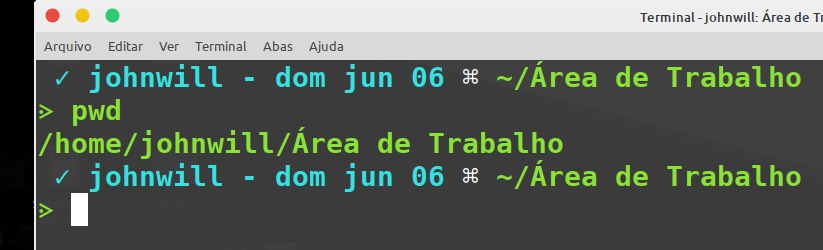

# Terminal Edit - Linux

To customize your terminal on some GNU/Linux, it is necessary to change the environment variable PS1 in ~/.bashrc

### Shell variable
By default, the shell has the PS1 variable, responsible for the environment, with the value of \u@\h:\w\$
which show username, hostname, the current working directory and the user privilege.

Since it's a variable in the shell, you can edit it for testing with the bash command.

**Example to see PS1**
``` bash
 > echo $PS1
 \[\e]0;\u@\h: \w\a\]${debian_chroot:+($debian_chroot)}\u@\h:\w\$

```

Now, to edit, you can change and test your change until you find your favorite.

``` bash
 > PS1='${debian_chroot:+($debian_chroot)}\[\033[1;31m\]\u\[\033[1;31m\]:\[\033[01;36m\]\w\[\033[00m\] '
```

It is important to see by detail is it has no space, because it is a bash
command, so it must follow the language standard.

Note: This change is temporary, and when closing the terminal will be reset
      and the variable defined in the .bashrc will remain unchanged.

### Suggestions

In [examples](https://github.com/gth1ago/terminal_edit/blob/main/PS1_options) are listed some PS1 suggestions to use.

### Official change
After choosing your variable, you can with your editor of preference, we will 
use vim, access the file ~/.bashrc, which holds the console settings.

``` bash
 > vim ~/.bashrc
```

So, in `.bashrc`, you can permanently change the`PS1`, 

``` bash
# ... code

  if [ "$color_prompt" = yes ]; then.
    PS1='$....'    # here
  else
    PS1='$....'    # here
   fi
# ... code

case "$TERM" in
  xterm*|rxvt*)
    PS1='$....'    # here 
    ;;
  *)
    ;;
  esac
```
Save and done!


### Screenshot of suggestions:

<p>
<p> 1 - </p>
  

<p> 2 - </p>
  

<p> 3 - </p>
  
</p>
